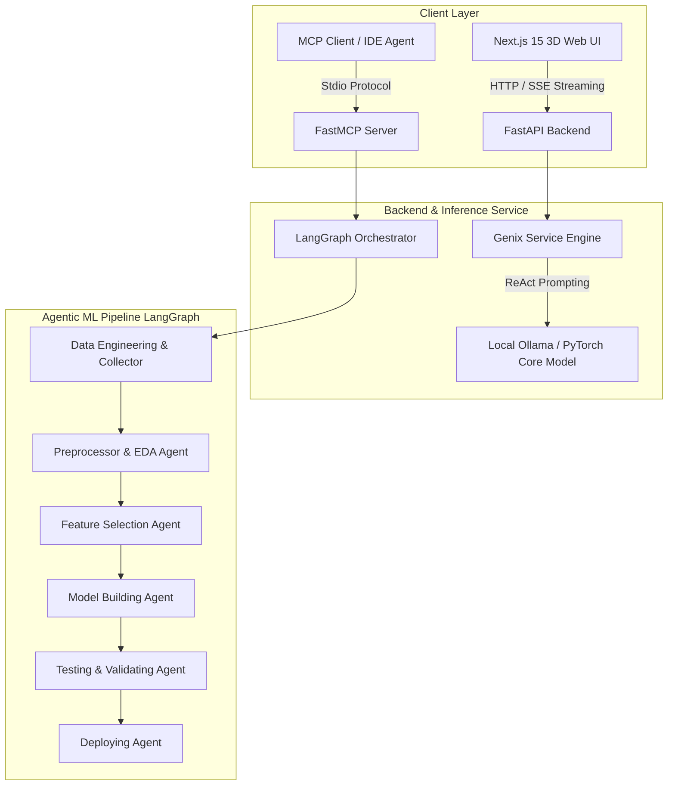

# 🤖 Agentic ML Engineer & Genix 3D AI Platform

[](https://www.python.org/)
[](https://nextjs.org/)
[](https://fastapi.tiangolo.com/)
[](https://www.langchain.com/langgraph)
[](https://pytorch.org/)
[](https://threejs.org/)
[](https://modelcontextprotocol.io/)
[](#license)

An end-to-end autonomous **Agentic Machine Learning System** integrated with a custom **PyTorch Transformer Model Engine**, **FastAPI Microservices**, **Model Context Protocol (MCP)** server, and an interactive **3D Motion-Driven Next.js Frontend**.

---

## 🌟 Overview

The **Agentic ML Engineer** platform automates the complete lifecycle of Data Science and Machine Learning tasks. Powered by **LangGraph** multi-agent orchestration, the system coordinates specialized AI agents (Data Collection, Preprocessing, Feature Engineering, Model Training, Validation, and Deployment) to turn raw problem statements into deployed ML solutions.

The platform combines a state-of-the-art **Next.js 15 / React Three Fiber (R3F)** frontend with real-time SSE streaming from a **FastAPI** backend that hooks directly into custom PyTorch Transformer architectures and local LLM models (via Ollama).

---

## ✨ Key Features

- 🧠 **LangGraph Multi-Agent Pipeline**: Autonomous state-machine graph routing across 9 specialized agent nodes:
  - **Data Collector Agent**: Identifies and fetches relevant datasets.
  - **Data Preprocessor Agent**: Handles missing values, encoding, and scaling.
  - **Data Engineering Agent**: Feature creation and domain-specific transformations.
  - **EDA Agent**: Performs exploratory data analysis and statistic extraction.
  - **Feature Selection Agent**: Selects optimal features using statistical heuristics.
  - **Model Building Agent**: Trains baseline and advanced ML models.
  - **Testing & Validating Agents**: Conducts unit evaluation and cross-validation metrics checking.
  - **Deploying Agent**: Packages and deploys models into operational endpoints.
- 🔌 **Model Context Protocol (MCP) Server**: FastMCP stdio interface enabling AI assistants (Claude Desktop, IDE agents) to invoke full end-to-end ML pipelines via standard protocol tools (`run_ml_pipeline`).
- ⚡ **FastAPI & Real-Time SSE Token Streaming**: Asynchronous REST backend supporting Server-Sent Events for live token generation streaming into the UI.
- 🔮 **Custom PyTorch Transformer Core (`core_model`)**: Custom BPE Tokenizer, ReAct Prompt Engine, native Transformer architecture, training loop, and inference pipeline.
- 🎨 **3D Motion Frontend**: Built with Next.js 15 App Router, React Three Fiber, Three.js, Lucide Icons, and Tailwind CSS. Features dynamic particle physics canvas, fluid custom cursor, glassmorphism dashboard, real-time chat, and authentication flows.

---

## 🏗️ System Architecture



---

## 📁 Repository Structure

```
Agentic ML Engineer/
├── agents/                     # LangGraph Multi-Agent System
│   ├── state.py                # AgentState graph schema & state flags
│   ├── llm_factory.py          # Unified LLM provider initializer (Ollama/OpenAI/Gemini)
│   ├── data_collector.py       # Dataset discovery & collection node
│   ├── data_preprocessor.py    # Data cleaning & normalization node
│   ├── data_engineering_agent.py
│   ├── eda_agent.py            # Automated exploratory data analysis node
│   ├── feature_selection_agent.py
│   ├── model_building_agent.py # ML model training & evaluation node
│   ├── testing_agent.py        # Model unit testing node
│   ├── validating_agent.py     # Cross-validation & metrics verification
│   └── deploying_agent.py      # Artifact packaging & deployment agent
├── backend/                    # FastAPI Microservice & Core Transformer
│   ├── main.py                 # FastAPI application routes & CORS configuration
│   ├── genix_service.py        # SSE Streaming bridge for ReAct LLM inference
│   └── core_model/             # Native PyTorch LLM Architecture
│       ├── genix_model.py      # PyTorch Transformer network architecture
│       ├── prompt_engine.py     # ReAct loop prompt formatter
│       ├── tokenizer.py        # Custom Byte-Pair Encoding (BPE) Tokenizer
│       ├── train.py            # Model training & checkpointing loop
│       └── inference.py        # Direct standalone PyTorch inference
├── frontend/                   # Next.js 3D Motion Frontend
│   ├── src/
│   │   ├── app/                # Next.js App Router (/, /chat, /login, /signup, /pricing)
│   │   └── components/         # R3F 3D Canvas (Scene.tsx), CustomCursor, Navbar
│   ├── package.json
│   └── tailwind.config.ts
├── main.py                     # Standalone CLI execution for LangGraph pipeline
├── mcp_server.py               # FastMCP Server implementation over stdio
└── implementation_plan.md      # Full architecture specification document
```

---

## 🚀 Getting Started

### Prerequisites

Ensure you have the following installed on your system:
- **Python**: `3.10` or higher
- **Node.js**: `18.0.0` or higher
- **npm** or **yarn**
- *(Optional)* **Ollama**: For local LLM inference (e.g. `qwen2.5:3b` or `llama3`)

---

### 1. Environment Setup

Clone the repository and set up a Python virtual environment:

```bash
# Clone the repository
git clone https://github.com/your-username/agentic-ml-engineer.git
cd agentic-ml-engineer

# Create Python virtual environment
python -m venv venv

# Activate virtual environment
# Windows (PowerShell):
.\venv\Scripts\Activate.ps1
# Linux/macOS:
source venv/bin/activate

# Install Python dependencies
pip install -r requirements.txt
```

Create a `.env` file in the root directory (and inside `backend/`):

```env
OPENAI_API_KEY=your_openai_api_key_here
GEMINI_API_KEY=your_gemini_api_key_here
OLLAMA_BASE_URL=http://localhost:11434
```

---

### 2. Running the Agentic ML Pipeline (CLI)

Run the autonomous multi-agent graph from the command line:

```bash
python main.py
```

---

### 3. Running the MCP Server

Start the Model Context Protocol (MCP) server to allow AI assistants (like Claude Desktop or IDE agents) to control the pipeline:

```bash
python mcp_server.py
```

**MCP Tool Registration:**
- **Tool Name:** `run_ml_pipeline`
- **Parameters:**
  - `dataset_description`: Description of available dataset/source.
  - `task`: High-level ML objective (e.g. `"Predict Customer Churn"`).

---

### 4. Running the FastAPI Backend Service

Start the backend API server with uvicorn:

```bash
cd backend
uvicorn main:app --reload --port 8000
```

The API will be available at:
- **Health Check:** `http://localhost:8000/health`
- **Swagger Docs:** `http://localhost:8000/docs`
- **Chat SSE Endpoint:** `POST http://localhost:8000/api/chat`

---

### 5. Running the 3D Motion Frontend

Navigate to the `frontend/` directory, install Node dependencies, and start the development server:

```bash
cd frontend
npm install
npm run dev
```

Open [http://localhost:3000](http://localhost:3000) in your browser to explore:
- **Landing Page (`/`)**: 3D interactive particle background, glassmorphism visual layout, and custom mouse cursor.
- **AI Chat Room (`/chat`)**: Real-time SSE streaming responses connected directly to the backend.
- **Authentication (`/login`, `/signup`)**: Modern user onboard UI.

---

## 🔬 Custom PyTorch Core Transformer Model

The `backend/core_model/` directory houses a native PyTorch implementation of a generative Transformer model:

- **Train Model:**
  ```bash
  python backend/core_model/train.py
  ```
- **Run Standalone Inference:**
  ```bash
  python backend/core_model/inference.py
  ```

---

## 🛡️ License

This project is licensed under the [MIT License](LICENSE).

---

## 🤝 Contributing

Contributions, issues, and feature requests are welcome! Feel free to check out the [issues page](https://github.com/your-username/agentic-ml-engineer/issues).

---

<p align="center">Crafted with ❤️ by the Agentic ML Engineering Team</p>
# Agentic-ML

