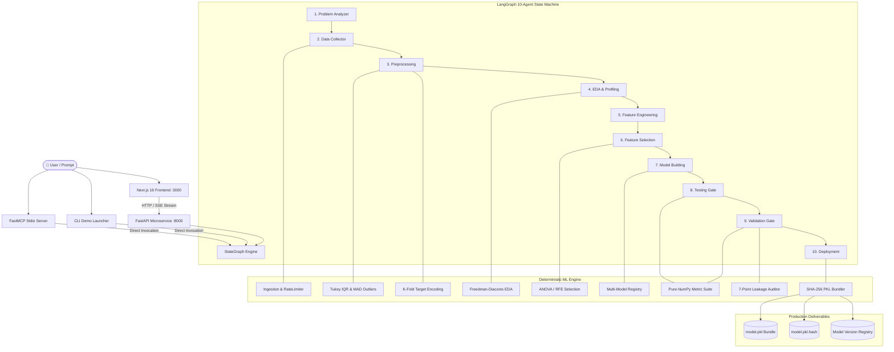

<div align="center">

# 🤖 Agentic ML Engineer

### *Autonomous Full-Stack AI Platform for End-to-End Machine Learning with Deterministic Intelligence*

[](https://www.python.org/)
[](https://nextjs.org/)
[](https://fastapi.tiangolo.com/)
[](https://www.langchain.com/langgraph)
[](https://pytorch.org/)
[](https://threejs.org/)
[](https://supabase.com/)
[](https://modelcontextprotocol.io/)
[](./LICENSE)

<br/>

> **A production-grade, end-to-end autonomous Machine Learning platform** — powered by a 10-node LangGraph state machine, an industrial **Deterministic Brain** (leakage-safe preprocessing, pure-NumPy zero-dependency metrics, multi-family model registry, and SHA-256 verified artifact bundling), a custom PyTorch Transformer engine, a FastAPI SSE streaming backend, an MCP protocol interface, and a 3D motion-driven Next.js frontend.

</div>

---

## 📋 Table of Contents

- [Overview](#-overview)
- [Key Features](#-key-features)
- [Deterministic Brain Architecture](#-deterministic-brain-architecture)
- [System Architecture](#-system-architecture)
- [Tech Stack](#-tech-stack)
- [Repository Structure](#-repository-structure)
- [Core Components In Depth](#-core-components-in-depth)
  - [1. LangGraph Multi-Agent Orchestration](#1-langgraph-multi-agent-orchestration)
  - [2. Deterministic ML Engine](#2-deterministic-ml-engine)
  - [3. Zero-Dependency Metrics & Evaluation Advisor](#3-zero-dependency-metrics--evaluation-advisor)
  - [4. Secure PKL Serialization & Model Version Registry](#4-secure-pkl-serialization--model-version-registry)
  - [5. Genix PyTorch Core Transformer](#5-genix-pytorch-core-transformer)
  - [6. FastAPI Backend & Real-Time SSE Streaming](#6-fastapi-backend--real-time-sse-streaming)
  - [7. FastMCP Protocol Interface](#7-fastmcp-protocol-interface)
  - [8. Next.js 16 3D Motion Frontend](#8-nextjs-16-3d-motion-frontend)
- [Getting Started](#-getting-started)
  - [Prerequisites](#prerequisites)
  - [Environment Setup](#1-environment-setup)
  - [Automated Demo Launcher (One-Click)](#2-automated-demo-launcher-one-click)
  - [Run the CLI Pipeline](#3-run-the-cli-pipeline)
  - [Run the FastAPI Backend](#4-run-the-fastapi-backend)
  - [Run the Next.js Frontend](#5-run-the-nextjs-frontend)
  - [Run the FastMCP Server](#6-run-the-fastmcp-server)
- [Testing & Verification](#-testing--verification)
- [API Reference](#-api-reference)
- [License](#-license)

---

## 🌟 Overview

**Agentic ML Engineer** bridges the gap between probabilistic Large Language Models and mathematically rigorous, deterministic Machine Learning engineering. Rather than asking an LLM to hallucinate code or blindly guess hyperparameters, the platform couples **LangGraph multi-agent cognitive reasoning** with an industrial **Deterministic Brain** executing proven statistical algorithms.

Hand it a problem statement (e.g., *"Build an optimal model to predict customer churn and package it for production"*), and the system autonomously executes:

1. **Problem Analysis**: Task inference, metric recommendation, and requirement profiling.
2. **Data Sourcing & Ingestion**: Automated loading, rate-limited polling, checkpointing, and synthetic benchmarking.
3. **Leakage-Safe Preprocessing**: MCAR/MAR/MNAR statistical diagnosis, Tukey IQR fence calculation, MAD-based modified Z-scores, and completeness deduplication.
4. **Categorical Encoding**: Cardinality profiling, out-of-fold $K$-fold smoothed target encoding, and inference schema alignment.
5. **Exploratory Data Analysis**: Freedman-Diaconis binning, skewness/kurtosis modeling, and multicollinearity detection ($|r| \ge \text{threshold}$) with automated drop suggestions.
6. **Feature Engineering & Selection**: Interaction terms, log transforms, and statistical filter (ANOVA/Mutual Info), wrapper (RFE), and tree-importance ranking.
7. **Multi-Model Training & Benchmarking**: Multi-family training (Linear, Trees, Ensembles, SVM, KNN, Clustering) with latency and accuracy benchmarking.
8. **Evaluation & Anti-Pattern Auditing**: Pure-NumPy metric evaluation, cross-validation gates, and automated detection of 7 classic evaluation mistakes.
9. **Secure Production Bundling**: Self-describing, SHA-256 hash-verified `.pkl` packaging with model registry versioning and schema-validated inference loaders.

---

## ✨ Key Features

| Feature | Description |
|---|---|
| 🧠 **10-Node LangGraph State Machine** | Autonomous routing through Problem Analysis $\rightarrow$ Sourcing $\rightarrow$ Cleaning $\rightarrow$ EDA $\rightarrow$ Feature Eng $\rightarrow$ Selection $\rightarrow$ Modeling $\rightarrow$ Testing $\rightarrow$ Validation $\rightarrow$ Deployment. |
| 🛡️ **Deterministic Brain** | Leakage-safe data cleaning (Tukey IQR, MAD Z-score), $K$-fold target encoding, Freedman-Diaconis EDA profiling, and multi-model registries. |
| 📊 **Zero-Dependency Metrics** | Pure-NumPy zero-dependency metrics for Classification (AUC, PR-AUC, F-beta), Regression (Adjusted $R^2$, RMSE/MAE ratio), and Clustering (Silhouette, Davies-Bouldin, Inertia). |
| 🔍 **7-Point Anti-Pattern Auditor** | Catches evaluation leakage, majority-class accuracy traps, test-threshold tuning, unweighted asymmetric error costs, and generalization gaps. |
| 📦 **Secure SHA-256 PKL Bundling** | Packages pipelines into self-describing, anti-tamper `.pkl` bundles with `PKLBundleLoader` schema validation and `PKLVersionManager`. |
| 🔌 **FastMCP Protocol Server** | Exposes `run_ml_pipeline` over stdio for direct integration into Claude Desktop, Cursor, and IDE agents. |
| ⚡ **Real-Time SSE Streaming** | FastAPI asynchronous generator streaming agent messages, tokens, and progress updates live over Server-Sent Events. |
| 🔮 **PyTorch Transformer Core** | Custom GPT-style architecture (`GenixModel`) with causal multi-head self-attention, BPE tokenization, and training loops. |
| 🎨 **Next.js 16 / React Three Fiber UI** | Fluid particle canvas, custom cursor, glassmorphism UI, syntax-highlighted code panels, and live pipeline visualization. |

---

## 🔬 Deterministic Brain Architecture

The platform's deterministic intelligence guarantees reproducible, leakage-free machine learning:

```
                                  DETERMINISTIC BRAIN ARCHITECTURE
                                  
   Phase 0: Sourcing & Ingestion          Phase 1: Leakage-Safe Cleaning       Phase 2: Categorical Encoding
   ├── collector_utils.py                 ├── cleaner.py & imputer.py          ├── encoder.py
   │   ├── with_retry (backoff/jitter)    │   ├── missingness_report           │   ├── classify_cardinality
   │   ├── RateLimiter                    │   ├── compute_iqr_fences           │   ├── fit_kfold_target_encoder
   │   └── collect_with_checkpoint        │   ├── modified_z_outliers (MAD)    │   ├── fit_frequency_encoder
   └── loader.py (CSV/Parquet/Synthetic)  └── MCAR/MAR/MNAR diagnostics        └── align_test_columns
                                                  │
                                                  ▼
   Phase 3: Visualizer / EDA              Phase 4: Dim. Reduction             Phase 5: Model Registry & Training
   ├── statistics.py & distributions.py   ├── selection.py                     ├── classification.py & regression.py
   │   ├── recommend_bins (F-D)           │   ├── SelectKBest (ANOVA / MI)     │   ├── LogisticReg, Trees, Ensembles
   │   ├── skewness & kurtosis            │   ├── RFE (Recursive Elimination)  │   └── SVM, KNN, Ridge, Lasso
   │   └── Multicollinearity (|r| >= th)  └── engineering.py                   ├── registry.py (recommend)
   └── OutlierDetector (IQR / MAD)            (Log transforms & Interactions)  └── training.py (compare_all)
                                                  │
                                                  ▼
   Phase 6: Unsupervised Clustering       Phase 7: Zero-Dependency Metrics     Phase 8: Production Deployment
   ├── clustering.py                      ├── metrics.py                       ├── pkl_utils.py
   │   ├── KMeans, DBSCAN, Hierarchical   │   ├── Classification (AUC, PR-AUC) │   ├── save_pkl_with_hash (SHA-256)
   └── Unsupervised Validation            │   ├── Regression (Adj R2, RMSE)    │   ├── safe_load_pkl (Anti-Tamper)
       (Silhouette, Davies-Bouldin)       │   └── Clustering (Silhouette, DB)  │   └── PKLVersionManager (Registry)
                                          └── validation.py (7 Anti-Patterns)  └── artifact_pipeline.py
                                                                                   └── PKLBundleLoader (Inference)
```

---

## 🏗️ System Architecture



---

## 🛠️ Tech Stack

### Core ML & AI Architecture
- **Language**: Python 3.10+
- **Agentic Orchestration**: LangGraph, LangChain Core
- **Deterministic ML**: Scikit-Learn, SciPy, NumPy, Pandas, Joblib
- **Deep Learning Core**: PyTorch 2.0+ (Custom Transformer with Causal Self-Attention)
- **LLM Integrations**: Groq (Llama 3.1 70B/8B), Google Gemini (2.0 Flash / Pro), Ollama Local

### Microservices & Protocols
- **Backend Framework**: FastAPI, Uvicorn, Pydantic v2
- **Streaming Protocol**: Server-Sent Events (`sse-starlette`, `httpx-sse`)
- **Tool Protocol**: FastMCP (Model Context Protocol)

### Frontend & User Interface
- **Framework**: Next.js 16.2 (App Router, Turbopack)
- **UI Library**: React 19, Tailwind CSS v4, Base UI
- **3D Graphics & Animations**: Three.js, React Three Fiber (`@react-three/fiber`), Drei, GSAP, Framer Motion
- **Code Visualization**: React Syntax Highlighter, Lucide Icons

### Database & Authentication
- **Database & Auth**: Supabase (PostgreSQL), NextAuth.js

---

## 📁 Repository Structure

```
Agentic ML Engineer/
├── Deterministic Brain/              # Curated algorithms, skill guides & references
│   ├── Dataset_Collector_Agent/      # Resilient collection & synthetic data skills
│   ├── Dataset_Cleaner_Agent/        # Missingness, Tukey fences & MAD outliers
│   ├── Data_Encoding_Agent/          # K-fold target encoding & cardinality rules
│   ├── Visualizer_Agent/             # Freedman-Diaconis EDA code generation
│   ├── Dimentionality_Reduction_Agent# Filter, Wrapper (RFE), and Embedded selection
│   ├── Supervise_Classifier_Agent/   # Multi-classifier registries & benchmark harnesses
│   ├── Supervise_Regression_Agent/   # OLS diagnostics & tree regressor families
│   ├── Unsupervised_Clustering_Agent/# KMeans, DBSCAN, Hierarchical clustering
│   ├── model_eval_toolkit/           # Zero-dependency metrics & DW advisors
│   └── pkl_generator_agent/          # Hash-verified self-describing bundle generator
│
├── src/agentic_ml/                   # Production Agentic ML Package
│   ├── agents/                       # 10 Specialized LangGraph Agent Controllers
│   │   ├── problem_analyzer/         # Problem formulation & task routing
│   │   ├── data_collector/           # Ingestion & quality verification
│   │   ├── preprocessing/            # Missingness & outlier fence clipping
│   │   ├── eda/                      # Statistical distribution profiling
│   │   ├── feature_engineering/      # Interaction & ratio synthesis
│   │   ├── feature_selection/        # ANOVA / mutual info filtering
│   │   ├── model_building/           # Candidate multi-model training
│   │   ├── testing/                  # Input/output schema testing
│   │   ├── validation/               # Cross-validation & anti-pattern checks
│   │   └── deployment/               # SHA-256 PKL artifact generation
│   ├── ml_engine/                    # Deterministic Algorithmic Subsystems
│   │   ├── data/                     # loader.py, collector_utils.py, schema.py
│   │   ├── preprocessing/            # cleaner.py, imputer.py, encoder.py, scaler.py
│   │   ├── eda/                      # statistics.py, distributions.py, correlations.py, outliers.py
│   │   ├── features/                 # selection.py, engineering.py
│   │   ├── models/                   # classification.py, regression.py, clustering.py, registry.py, training.py, tuning.py
│   │   ├── evaluation/               # metrics.py, validation.py, dw_advisor.py
│   │   └── pipelines/                # pkl_utils.py, artifact_pipeline.py, inference_pipeline.py
│   ├── orchestration/                # graph.py (LangGraph StateGraph & Router)
│   ├── api/                          # FastAPI microservice routes & controllers
│   ├── llm/                          # Unified multi-provider LLM factory
│   ├── mcp/                          # FastMCP stdio server implementation
│   └── state/                        # AgentState typed dictionary definitions
│
├── frontend/                         # Next.js 16 / React Three Fiber UI
│   ├── src/app/                      # Next.js App Router (Landing, Pipeline Studio, Chat)
│   ├── src/components/               # 3D canvas, particle cursor, metrics panels
│   └── package.json                  # Frontend dependencies
│
├── tests/                            # Comprehensive Automated Test Suite
│   ├── unit/ml/                      # 33 unit tests for all ML engine subsystems
│   └── integration/graph/            # End-to-end LangGraph state machine test
│
├── scripts/                          # Utilities & Launchers
│   ├── run_demo.py                   # Automated full-stack demo launcher
│   └── test_sse_endpoint.ps1         # SSE streaming verification script
│
├── main.py                           # CLI entry point for the agentic pipeline
├── mcp_server.py                     # Root MCP server launcher
├── run_demo.bat                      # Windows Batch demo launcher
├── run_demo.ps1                      # Windows PowerShell demo launcher
└── requirements.txt                  # Python dependencies
```

---

## 🔍 Core Components In Depth

### 1. LangGraph Multi-Agent Orchestration
The pipeline runs as an autonomous state machine compiled with `langgraph.graph.StateGraph(AgentState)`. A conditional master router monitors state gates (`data_collected`, `data_preprocessed`, `eda_completed`, etc.) to dynamically route tasks across the 10 agents.

```python
from src.agentic_ml.orchestration.graph import build_agentic_graph

app = build_agentic_graph()
final_state = app.invoke({
    "current_task": "Build an optimal customer churn classifier",
    "task_type": "classification"
})
print("Winning Model:", final_state["best_model_name"])
print("Production Artifact:", final_state["artifact_path"])
```

### 2. Deterministic ML Engine
- **Missingness Diagnostics (`cleaner.py`)**: Uses two-sample $t$-tests (`classify_missingness_hint`) to distinguish MCAR from MAR/MNAR, applying median imputation and Tukey IQR fences ($[Q_1 - 1.5\text{IQR}, Q_3 + 1.5\text{IQR}]$) on the training set only.
- **Categorical Target Encoding (`encoder.py`)**: Performs out-of-fold $K$-fold smoothed mean encoding with smoothing parameter $m$:
  $$\hat{x}_i = \frac{n \cdot \bar{y}_c + m \cdot \bar{y}_{\text{global}}}{n + m}$$
- **EDA & Multicollinearity (`statistics.py`, `correlations.py`)**: Uses the Freedman-Diaconis rule for optimal histogram bin width ($h = 2\text{IQR} \cdot n^{-1/3}$) and detects multicollinear pairs ($|r| \ge 0.80$), recommending the removal of the feature with lower target correlation.

### 3. Zero-Dependency Metrics & Evaluation Advisor
Implemented in pure NumPy with zero external runtime dependencies:
- **Classification**: Confusion matrix, accuracy, precision, recall, specificity, $F_1$, $F_\beta$, ROC-AUC (trapezoidal integration), Precision-Recall AUC (Average Precision).
- **Regression**: MAE, MSE, RMSE, $R^2$, and Adjusted $R^2$:
  $$\bar{R}^2 = 1 - (1 - R^2) \frac{n - 1}{n - p - 1}$$
- **Clustering**: Silhouette Coefficient, Davies-Bouldin Index, Inertia (WCSS).
- **Evaluation Auditor (`check_common_mistakes`)**: Automatically inspects training and validation context to flag 7 classic anti-patterns:
  1. Evaluating directly on training data
  2. Relying on accuracy alone on imbalanced datasets ($>80\%$ majority class)
  3. Tuning decision thresholds on test data
  4. Unweighted asymmetric error costs in critical domains
  5. Reporting single-metric summaries without error bounds
  6. Data leakage from fitting scalers/encoders on combined train+test sets
  7. Severe train-to-val generalization gaps ($>15\%$)

### 4. Secure PKL Serialization & Model Version Registry
Standard pickles are opaque and susceptible to tampering. The platform uses a hardened bundle format:
- **Integrity Verification**: `save_pkl_with_hash` computes a SHA-256 hash saved to `<model>.pkl.hash`. `safe_load_pkl` enforces checksum equality, raising `PKLSecurityError` if tampering is detected.
- **Self-Describing Deployment Bundle**: Combines model weights, feature schema contracts, categorical mappings, and evaluation reports.
- **Inference Loader (`PKLBundleLoader`)**: Validates incoming DataFrames against expected column names and ordering before executing `.predict()` or `.predict_proba()`.
- **Model Version Registry (`PKLVersionManager`)**: Tracks versions (`v1`, `v2`, ...), metadata, and production promotion (`promote_to_production`).

---

## 🚀 Getting Started

### Prerequisites
- **Python 3.10+**
- **Node.js 18+** & `npm`
- *(Optional)* **Google Chrome** (for automated browser demo launch)

### 1. Environment Setup

```bash
# Clone the repository
git clone https://github.com/niharsalvi2-spec/Agentic-Ml.git
cd Agentic-Ml

# Create and activate Python virtual environment
python -m venv venv
.\venv\Scripts\activate   # Windows
# source venv/bin/activate # Linux / macOS

# Install Python dependencies
pip install -r requirements.txt

# Install Frontend dependencies
cd frontend
npm install
cd ..
```

Configure your environment variables:
```bash
cp .env.example .env
```
*(Optionally set `GROQ_API_KEY`, `GEMINI_API_KEY`, or leave unset to use local/dummy fallback).*

---

### 2. Automated Demo Launcher (One-Click)

Launch the FastAPI backend, Next.js frontend, health checks, and Chrome studio with a single command:

```powershell
# PowerShell
.\run_demo.ps1

# Or Windows Batch
run_demo.bat

# Or Python directly
python scripts/run_demo.py
```

This automatically opens **Google Chrome** to `http://localhost:3000/pipeline` with live streaming agent visualization.

---

### 3. Run the CLI Pipeline

Execute the full 10-agent pipeline directly from the command line:

```bash
python main.py
```

---

### 4. Run the FastAPI Backend

```bash
uvicorn src.agentic_ml.api.main:app --host 0.0.0.0 --port 8000 --reload
```
- **API Documentation (Swagger UI)**: [http://localhost:8000/docs](http://localhost:8000/docs)
- **Health Check**: [http://localhost:8000/health](http://localhost:8000/health)

---

### 5. Run the Next.js Frontend

```bash
cd frontend
npm run dev
```
- **Pipeline Studio**: [http://localhost:3000/pipeline](http://localhost:3000/pipeline)
- **Landing Page**: [http://localhost:3000](http://localhost:3000)

---

### 6. Run the FastMCP Server

Connect your IDE or Claude Desktop to the autonomous pipeline via the Model Context Protocol:

```bash
python mcp_server.py
```

#### Claude Desktop Configuration (`claude_desktop_config.json`):
```json
{
  "mcpServers": {
    "agentic-ml": {
      "command": "python",
      "args": ["c:/Users/nihar/Desktop/Agentic Engineer/AL and ML/Core/Agentic ML Engineer/mcp_server.py"]
    }
  }
}
```

---

## 🧪 Testing & Verification

The platform includes a comprehensive test suite validating all deterministic algorithms and multi-agent workflows:

```bash
# Run all unit tests for the deterministic ML engine
python -m unittest discover tests/unit/ml

# Run end-to-end LangGraph state machine integration test
python -m unittest tests/integration/graph/test_agentic_workflow.py
```

### Test Coverage Highlights:
- **`test_cleaner.py`**: Tukey IQR fence clipping, MAD modified-z outlier masks, completeness deduplication, missingness reporting.
- **`test_encoder.py`**: Out-of-fold $K$-fold target encoding, frequency encoding, unseen category handling, column alignment.
- **`test_eda.py`**: Freedman-Diaconis bin estimation, skewness/kurtosis calculations, multicollinearity detection.
- **`test_models.py`**: Multi-model candidate training, rule-based recommendation scoring, benchmarking.
- **`test_metrics_and_evaluation.py`**: Pure-NumPy classification, regression, clustering metrics, 7-point anti-pattern audit.
- **`test_pkl_pipeline.py`**: SHA-256 integrity verification, anti-tamper exception triggers, bundle loading, version registry.
- **`test_agentic_workflow.py`**: Complete 10-agent LangGraph execution from problem analysis to model deployment.

---

## 📡 API Reference

| Method | Endpoint | Description |
|---|---|---|
| `GET` | `/health` | Microservice health check and uptime status. |
| `POST` | `/api/pipeline/stream` | Server-Sent Events (SSE) stream executing the 10-agent pipeline. |
| `POST` | `/api/chat` | Real-time multi-agent conversational SSE stream. |
| `POST` | `/api/prediction` | Executes inference using the deployed model artifact. |
| `GET` | `/api/artifacts` | Lists all generated `.pkl` bundles, metrics, and metadata. |
| `GET` | `/api/artifacts/download/{filename}` | Downloads a verified `.pkl` model bundle. |
| `GET` | `/api/datasets` | Profiles and lists available training and benchmark datasets. |

---

## 📄 License

This project is licensed under the MIT License — see the [LICENSE](LICENSE) file for details.

---

<div align="center">
<b>Built for autonomous, mathematically rigorous Machine Learning Engineering.</b>
</div>