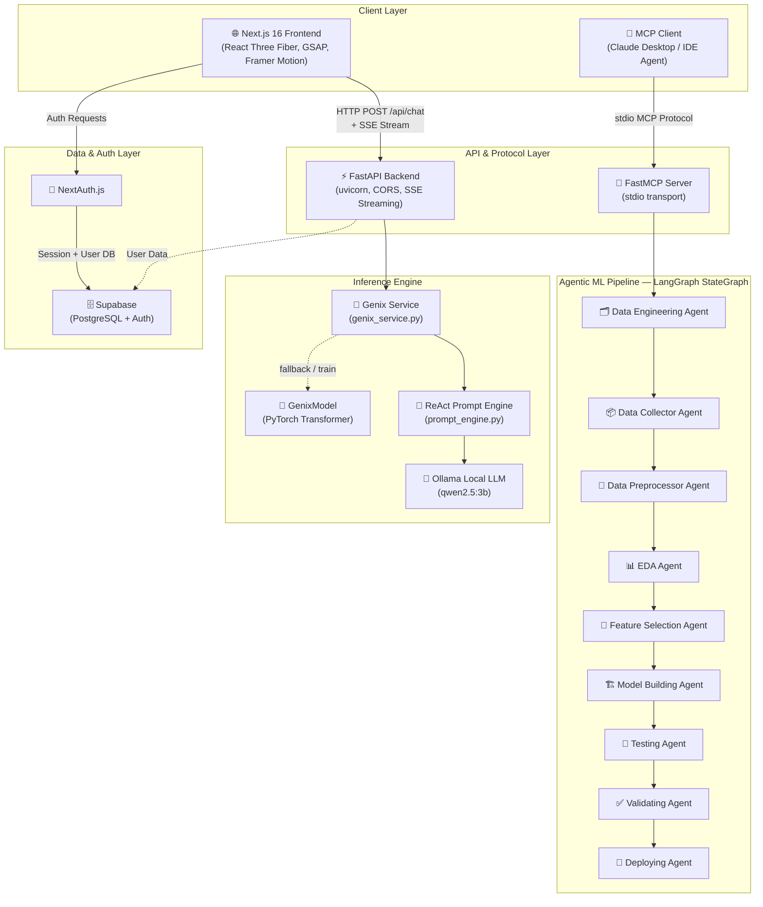

<div align="center">

# 🤖 Agentic ML Engineer

### *Autonomous Full-Stack AI Platform for End-to-End Machine Learning*

[](https://www.python.org/)
[](https://nextjs.org/)
[](https://fastapi.tiangolo.com/)
[](https://www.langchain.com/langgraph)
[](https://pytorch.org/)
[](https://threejs.org/)
[](https://supabase.com/)
[](https://modelcontextprotocol.io/)
[](./LICENSE)

<br/>

> **A production-grade, end-to-end autonomous Machine Learning platform** — where 9 specialized LangGraph AI agents orchestrate the complete ML lifecycle, powered by a custom PyTorch Transformer engine, a FastAPI streaming backend, an MCP protocol interface, and a 3D motion-driven Next.js frontend.

</div>

---

## 📋 Table of Contents

- [Overview](#-overview)
- [Key Features](#-key-features)
- [System Architecture](#-system-architecture)
- [Tech Stack](#-tech-stack)
- [Repository Structure](#-repository-structure)
- [Core Components In Depth](#-core-components-in-depth)
  - [LangGraph Multi-Agent Pipeline](#1-langgraph-multi-agent-pipeline)
  - [Genix PyTorch Core Model](#2-genix-pytorch-core-model)
  - [FastAPI Backend & SSE Streaming](#3-fastapi-backend--sse-streaming)
  - [MCP Server (Model Context Protocol)](#4-mcp-server-model-context-protocol)
  - [Next.js 3D Motion Frontend](#5-nextjs-3d-motion-frontend)
  - [Supabase & Authentication](#6-supabase--authentication)
- [How Everything Connects](#-how-everything-connects)
- [Getting Started](#-getting-started)
  - [Prerequisites](#prerequisites)
  - [Environment Setup](#1-environment-setup)
  - [Run the Agentic Pipeline (CLI)](#2-run-the-agentic-pipeline-cli)
  - [Run the MCP Server](#3-run-the-mcp-server)
  - [Run the FastAPI Backend](#4-run-the-fastapi-backend)
  - [Run the Frontend](#5-run-the-frontend)
  - [Train / Run the Core Model](#6-train--run-the-core-model)
- [Environment Variables Reference](#-environment-variables-reference)
- [API Reference](#-api-reference)
- [Agent Pipeline Deep Dive](#-agent-pipeline-deep-dive)
- [Deployment Guide](#-deployment-guide)
- [Contributing](#-contributing)
- [License](#-license)

---

## 🌟 Overview

**Agentic ML Engineer** is not just another AI demo — it is a fully integrated, multi-layer autonomous system designed to solve real Machine Learning problems from start to finish, without human intervention. Hand it a problem statement and it will:

1. **Autonomously design** the data engineering strategy
2. **Collect or synthesize** the required dataset
3. **Preprocess and clean** the data automatically
4. **Perform Exploratory Data Analysis** and extract statistical insights
5. **Select optimal features** using statistical heuristics
6. **Build and train** multiple ML models
7. **Test and validate** with cross-validation metrics
8. **Recommend and deploy** the model using the optimal deployment strategy

All of this is orchestrated by a **LangGraph state machine graph** that routes between 9 specialized AI agents, each powered by real LLMs (Groq Llama 3.1, Gemini Flash, or Ollama locally).

The platform ships with:
- A **custom PyTorch Transformer** (`GenixModel`) for native language generation
- A **FastAPI microservice** with real-time **Server-Sent Events (SSE)** token streaming
- A **FastMCP stdio server** for direct AI assistant integration (Claude Desktop, IDE agents)
- A **Next.js 16 / React Three Fiber** 3D frontend with GSAP animations, glassmorphism design, and live streaming chat
- A **Supabase** backend for user authentication and subscription management

---

## ✨ Key Features

| Feature | Description |
|---|---|
| 🧠 **9-Node LangGraph Pipeline** | Conditional state machine graph that routes autonomously through data collection → deployment |
| 🔌 **MCP Protocol Interface** | FastMCP stdio server exposing `run_ml_pipeline` — call the full pipeline from Claude Desktop or any IDE agent |
| ⚡ **Real-Time SSE Streaming** | FastAPI async generator streams Ollama/LLM tokens live to the Next.js frontend, token by token |
| 🔮 **Custom PyTorch Transformer** | Native GPT-style architecture (CausalSelfAttention + MLP blocks) with BPE tokenizer, training loop, and checkpoint inference |
| 🎨 **3D React Three Fiber UI** | Dynamic particle canvas, custom fluid cursor, glassmorphism panels, GSAP entry animations |
| 📄 **Live Code Artifact Pane** | AI-generated code appears in a VSCode-style side panel with syntax highlighting and copy functionality |
| 🔑 **Multi-LLM Factory** | Unified `get_llm()` factory: priority-based selection between Groq, Gemini, and a fallback DummyLLM |
| 🎯 **ReAct Prompt Engine** | XML-structured prompt library supporting Zero-shot, Few-shot, CoT, Tree-of-Thoughts, and ReAct loops |
| 👤 **Auth & Subscriptions** | NextAuth.js + Supabase for secure user sessions, role-based access, and subscription tiers |

---

## 🏗️ System Architecture



---

## 🛠 Tech Stack

### Backend & AI

| Technology | Role | Version |
|---|---|---|
| **Python** | Core runtime for all agents and backend | 3.10+ |
| **LangGraph** | Multi-agent state machine orchestration | Latest |
| **LangChain Core** | Message schemas, runnable interfaces | Latest |
| **LangChain Groq** | Groq API LLM integration (Llama 3.1) | Latest |
| **LangChain Google GenAI** | Gemini API LLM integration | Latest |
| **FastAPI** | Async REST API microservice | 0.100+ |
| **Uvicorn** | ASGI server for FastAPI | Latest |
| **PyTorch** | Custom Transformer model architecture | 2.0+ |
| **httpx** | Async HTTP client for Ollama streaming | Latest |
| **FastMCP** | Model Context Protocol stdio server | Latest |
| **Supabase Python** | Database and auth client | Latest |
| **Python-dotenv** | Environment variable management | Latest |

### Frontend

| Technology | Role | Version |
|---|---|---|
| **Next.js** | React framework with App Router | 16.2.9 |
| **React** | UI component library | 19.2.4 |
| **TypeScript** | Type-safe frontend development | 5+ |
| **React Three Fiber (R3F)** | 3D canvas rendering on the web | 9.6.1 |
| **@react-three/drei** | R3F helper components (OrbitControls, etc.) | 10.7.7 |
| **Three.js** | 3D WebGL rendering engine | 0.185.0 |
| **Framer Motion** | Declarative animation library | 12.42.0 |
| **GSAP** | High-performance timeline animations | 3.15.0 |
| **NextAuth.js** | Authentication for Next.js | 4.24.14 |
| **React Markdown** | Streaming markdown renderer | 10.1.0 |
| **React Syntax Highlighter** | Code block rendering (VSCode Dark+) | 16.1.1 |
| **Lucide React** | Icon library | 1.21.0 |
| **Tailwind CSS** | Utility-first CSS framework | 4+ |
| **Shadcn/ui** | Accessible component primitives | 4.12.0 |

---

## 📁 Repository Structure

```
Agentic ML Engineer/
│
├── agents/                          # 🧠 LangGraph Multi-Agent System
│   ├── __init__.py                  #    Module exports for all agent nodes & AgentState
│   ├── state.py                     #    AgentState TypedDict — the shared graph state schema
│   ├── llm_factory.py               #    Unified LLM factory (Groq → Gemini → DummyLLM fallback)
│   ├── data_collector.py            #    Node: Dataset discovery & collection
│   ├── data_engineering_agent.py    #    Node: Feature creation & domain transformations
│   ├── data_preprocessor.py         #    Node: Cleaning, encoding, normalization
│   ├── eda_agent.py                 #    Node: Automated exploratory data analysis
│   ├── feature_selection_agent.py   #    Node: Statistical feature selection heuristics
│   ├── model_building_agent.py      #    Node: Multi-model training & evaluation
│   ├── testing_agent.py             #    Node: Unit-level model evaluation
│   ├── validating_agent.py          #    Node: Cross-validation & metrics verification
│   └── deploying_agent.py           #    Node: Deployment strategy recommendation & packaging
│
├── backend/                         # ⚡ FastAPI Microservice & Core ML Engine
│   ├── main.py                      #    FastAPI app — routes, CORS, SSE endpoint
│   ├── genix_service.py             #    GenixService — Ollama SSE streaming bridge
│   ├── core/
│   │   └── config.py                #    App settings (Supabase URL/KEY from env)
│   ├── core_model/                  # 🔮 Native PyTorch LLM Architecture
│   │   ├── config.py                #    GenixConfig — scalable Transformer hyperparameters
│   │   ├── genix_model.py           #    GenixModel — CausalSelfAttention + MLP + Block
│   │   ├── prompt_engine.py         #    PromptEngine — Zero-shot, Few-shot, CoT, ReAct, ToT
│   │   ├── train.py                 #    Training loop with checkpointing
│   │   ├── inference.py             #    Standalone inference from saved checkpoint
│   │   ├── genix_baseline.pt        #    Pre-trained model checkpoint (~66MB)
│   │   └── data/
│   │       ├── input.txt            #    Raw training corpus
│   │       ├── prepare.py           #    Data preparation & BPE tokenization script
│   │       ├── train.bin            #    Tokenized training split (binary)
│   │       └── val.bin              #    Tokenized validation split (binary)
│   ├── db/
│   │   └── supabase.py              #    Supabase client factory
│   └── models/
│       ├── user.py                  #    Pydantic User schemas (UserBase, UserCreate, UserInDB)
│       └── subscription.py          #    Pydantic Subscription schema
│
├── frontend/                        # 🎨 Next.js 16 3D Motion Frontend
│   ├── src/
│   │   ├── app/                     #    Next.js App Router
│   │   │   ├── page.tsx             #    Landing page — 3D particle canvas + hero
│   │   │   ├── layout.tsx           #    Root layout — fonts, metadata, Providers
│   │   │   ├── globals.css          #    Global CSS variables & base styles
│   │   │   ├── chat/
│   │   │   │   ├── page.tsx         #    Main AI chat room with SSE streaming & artifact pane
│   │   │   │   ├── layout.tsx       #    Chat context provider (history, sidebar state)
│   │   │   │   ├── history/page.tsx #    Conversation history panel
│   │   │   │   ├── projects/page.tsx#    Projects management view
│   │   │   │   └── customize/page.tsx #  Model & persona customization
│   │   │   ├── login/page.tsx       #    Authentication — sign in UI
│   │   │   ├── signup/page.tsx      #    Authentication — registration UI
│   │   │   ├── pricing/page.tsx     #    Subscription tier selection
│   │   │   └── api/auth/[...nextauth]/route.ts  # NextAuth.js API route handler
│   │   └── components/
│   │       ├── Scene.tsx            #    React Three Fiber 3D particle scene
│   │       ├── Navbar.tsx           #    Glassmorphism navigation bar
│   │       ├── CustomCursor.tsx     #    Fluid custom mouse cursor
│   │       └── Providers.tsx        #    Session + theme context providers
│   ├── package.json                 #    Node.js dependencies
│   ├── next.config.ts               #    Next.js configuration
│   ├── tailwind.config.ts           #    Tailwind CSS configuration
│   └── tsconfig.json                #    TypeScript compiler options
│
├── main.py                          # 🚀 CLI entry point — builds & runs LangGraph pipeline
├── mcp_server.py                    # 🔌 FastMCP stdio server — exposes `run_ml_pipeline` tool
├── implementation_plan.md           # 📐 Full architecture specification document
└── .env                             # 🔑 Root environment variables (API keys)
```

---

## 🔬 Core Components In Depth

### 1. LangGraph Multi-Agent Pipeline

**Files:** `agents/`, `main.py`

The agentic pipeline is built on **LangGraph's `StateGraph`** — a directed graph where each node is a specialized AI agent. All agents share a single **`AgentState`** TypedDict that flows through the graph:

```python
class AgentState(TypedDict):
    messages: Annotated[Sequence[BaseMessage], operator.add]  # Accumulated conversation
    current_task: str        # The ML problem to solve
    dataset_path: str        # Path to data (if collected)
    dataset_info: dict       # Metadata about the dataset
    # Progress flags
    data_engineering_completed: bool
    data_collected: bool
    data_preprocessed: bool
    eda_completed: bool
    feature_selection_completed: bool
    model_built: bool
    model_tested: bool
    model_validated: bool
    deployment_completed: bool
    # Routing
    next_agent: str          # Explicit override for next node
```

#### Routing Logic — `master_agent_router`

The `master_agent_router` function acts as a **smart conditional router** at every edge. It first checks for an explicit `next_agent` override (set by agents that want to jump back in the pipeline), then falls back to sequential flag-checking:

```
START → data_engineering → data_collector → data_preprocessor
      → eda_agent → feature_selection → model_building
      → testing_agent → validating_agent → deploying_agent → END
```

Each agent can also break linearity by setting `next_agent` — enabling **retry loops** and **non-linear control flow** out of the box.

#### The LLM Factory

`agents/llm_factory.py` implements a **priority-based multi-LLM selector**:

1. ✅ **Groq** (`llama-3.1-8b-instant`) — if `GROQ_API_KEY` is set → fast, free-tier inference
2. ✅ **Google Gemini** (`gemini-1.5-flash`) — if `GEMINI_API_KEY` is set → strong reasoning
3. ⚠️ **DummyLLM** — fallback for offline/testing environments; returns descriptive mock responses

This means the system works with **zero API keys** for local testing while seamlessly upgrading when keys are available.

#### Agent Descriptions

| Agent Node | Key Responsibility |
|---|---|
| `data_engineering_agent` | Designs the feature engineering strategy, creates derived columns, domain-specific transforms |
| `data_collector` | Identifies and fetches the appropriate dataset (public repos, synthetic generation, or user-provided) |
| `data_preprocessor` | Handles missing values, categorical encoding (OHE/Label), numerical scaling (StandardScaler/MinMax) |
| `eda_agent` | Performs automated EDA: distributions, correlations, outlier detection, key statistics extraction |
| `feature_selection` | Applies statistical tests (chi-squared, correlation thresholds, importance scores) to select optimal features |
| `model_building` | Trains multiple models (XGBoost, Random Forest, PyTorch NNs), compares via cross-validation |
| `testing_agent` | Unit-level evaluation: accuracy, precision, recall, F1, ROC-AUC per model |
| `validating_agent` | k-fold cross-validation, holdout set metrics, bias/variance trade-off assessment |
| `deploying_agent` | Applies a **Deployment Logic Matrix** to recommend the ideal packaging strategy (FastAPI local / Docker / Cloud) |

#### The Deployment Logic Matrix

The deploying agent uses a sophisticated decision matrix instead of a one-size-fits-all approach:

```
Hackathon viva (local)    → FastAPI, no Docker (avoids GPU passthrough overhead)
Remote access needed      → Cloud (Render/Railway) orchestration layer only
Multi-team reproducibility → Docker Compose
Unattended background     → FastAPI + containerized worker
```

---

### 2. Genix PyTorch Core Model

**Files:** `backend/core_model/`

The `GenixModel` is a **scratch-built GPT-style decoder-only Transformer** in pure PyTorch:

#### Architecture

```
Input IDs
   │
   ▼
Token Embedding (wte)  +  Positional Embedding (wpe)
   │
   ▼
Dropout
   │
   ▼
┌─────────────────────────────────────┐
│  Transformer Block × n_layer        │
│  ┌──────────────────────────────┐   │
│  │  LayerNorm                   │   │
│  │  CausalSelfAttention         │   │  ← Q, K, V projections
│  │   • n_head parallel heads    │   │  ← Causal mask (lower-triangular)
│  │   • Scaled dot-product attn  │   │  ← Softmax + Dropout
│  │  Residual Connection         │   │
│  │  LayerNorm                   │   │
│  │  MLP (4× expansion + GELU)   │   │
│  │  Residual Connection         │   │
│  └──────────────────────────────┘   │
└─────────────────────────────────────┘
   │
   ▼
Final LayerNorm
   │
   ▼
LM Head (Linear → vocab_size)  [weight-tied to wte]
   │
   ▼
Logits / Cross-Entropy Loss
```

#### Configuration (`GenixConfig`)

| Parameter | Default | Nano Config | Description |
|---|---|---|---|
| `vocab_size` | 50257 | 50257 | GPT-2/tiktoken vocabulary |
| `max_seq_len` | 2048 | 512 | Context window (attention scope) |
| `n_embd` | 768 | 256 | Embedding + hidden state dim |
| `n_head` | 12 | 4 | Parallel attention heads |
| `n_layer` | 12 | 4 | Transformer blocks depth |
| `dropout` | 0.1 | 0.1 | Regularization dropout rate |
| `bias` | False | False | Bias in Linear/LayerNorm layers |

The **Nano config** is designed for CPU inference during local testing. The full config targets GPU cluster deployment.

#### Weight Tying

The model uses **weight tying** (`wte.weight = lm_head.weight`) — a parameter-efficiency technique where the input embedding matrix and the output projection share the same weights, reducing parameters while improving convergence.

#### Pre-trained Checkpoint

A pre-trained baseline checkpoint (`genix_baseline.pt`, ~66MB) ships with the repository. It was trained on the text corpus in `backend/core_model/data/input.txt`.

---

### 3. FastAPI Backend & SSE Streaming

**Files:** `backend/main.py`, `backend/genix_service.py`

The backend is a minimal but powerful **FastAPI** application that bridges the Next.js frontend to the local LLM inference engine.

#### Chat Endpoint (SSE)

```
POST /api/chat
Body: { "prompt": string, "model": string }
Response: text/event-stream (Server-Sent Events)
```

The `GenixService.stream_inference()` is an **async generator** that:

1. Injects the user prompt into the **ReAct prompt structure** via `PromptEngine.react_loop()`
2. Sends a `[Thinking...]` signal to the frontend immediately (UX responsiveness)
3. Opens an async HTTP stream to **Ollama** (`http://localhost:11434/api/generate`)
4. Parses each streamed JSON line from Ollama and re-emits it as SSE `data:` frames
5. Sends `data: [DONE]` when the stream is complete

Frontend receives tokens in this format:
```json
data: {"agent": "Genix Engine (Qwen 2.5)", "message": "token_text"}
```

The frontend's `ReadableStream` reader reconstructs the full response token-by-token in the state, enabling a **live, real-time typing effect** in the chat UI.

#### The ReAct Prompt Engine

`backend/core_model/prompt_engine.py` is a **multi-technique prompt structuring library** using XML tags for robust output parsing. It supports:

| Method | Description |
|---|---|
| `zero_shot(system, task)` | Direct task with no examples |
| `few_shot(system, examples, task)` | In-context learning with demonstrations |
| `chain_of_thought(task)` | Forces `<think>` reasoning trace before answer |
| `react_loop(task, tools)` | Full ReAct format: Thought → Action → Observation cycles |
| `tree_of_thoughts(task, branches)` | Multi-path reasoning with branch evaluation |
| `extract_xml_tag(text, tag)` | Utility to parse structured XML output |

The **ReAct system prompt** instructs the model to behave as an elite ML engineer, output complete production-ready Python codebases (not snippets), include full EDA pipelines, multiple models, hyperparameter tuning, and visualization dashboards.

---

### 4. MCP Server (Model Context Protocol)

**File:** `mcp_server.py`

The **FastMCP server** exposes the entire LangGraph pipeline as a single callable **MCP Tool**, making the platform natively compatible with:
- **Claude Desktop** (via `mcp_config.json`)
- **Cursor IDE** agent integrations
- **Any MCP-compatible AI assistant**

```python
@mcp.tool()
def run_ml_pipeline(dataset_description: str, task: str) -> str:
    """
    Run the Master ML Engineer Agentic Pipeline.
    
    Args:
        dataset_description: Description of data available (or lack thereof)
        task: The ML problem (e.g., 'Predict Customer Churn')
    
    Returns:
        Full aggregated log of all agent outputs
    """
```

The server streams the LangGraph graph, collects all agent outputs into a formatted log, and returns the complete pipeline execution result as a single structured string.

**Transport:** `stdio` — the MCP protocol standard for local tool invocation.

---

### 5. Next.js 3D Motion Frontend

**Files:** `frontend/src/`

The frontend is a **Next.js 16 App Router** application built for visual impact and real-time AI interaction.

#### Pages

| Route | Description |
|---|---|
| `/` | Landing page with interactive 3D particle physics canvas (React Three Fiber), glassmorphism hero, and custom cursor |
| `/chat` | Main AI workspace — streaming chat + live VSCode-style artifact pane |
| `/chat/history` | Conversation history sidebar |
| `/chat/projects` | Projects management view |
| `/chat/customize` | Model selection and persona customization |
| `/login` | Authentication — sign in |
| `/signup` | Authentication — registration |
| `/pricing` | Subscription tier selection |

#### Chat Page — Technical Details

The `/chat` page is the core of the user experience. Key behaviors:

**SSE Streaming:**
```typescript
const reader = response.body.getReader();
// Reads chunks → parses SSE frames → appends tokens to state
// Last message from same agent gets concatenated (smooth streaming)
```

**Live Code Artifact Pane:**
- Scans incoming messages for ` ```language ` code blocks in real-time
- When detected, a VSCode Dark+ styled pane **slides in from the right** (GSAP animation)
- Shows the generated code file with full syntax highlighting (`react-syntax-highlighter`)
- One-click **Copy to Clipboard** functionality
- The chat text automatically strips code blocks and shows `[Code rendering in Genix Workspace...]` instead

**Model Selector:**
Users can switch between `Gemini 3.5 Flash`, `Gemini 3.1 Pro`, `Groq Llama 3.1`, and `Groq Mixtral` directly in the input form.

#### 3D Scene (`Scene.tsx`)

Built with **React Three Fiber** + **@react-three/drei**, the landing page features:
- Dynamic particle physics system with thousands of animated points
- Interactive camera controls (OrbitControls)
- Responsive canvas sizing
- Smooth entry animations

#### Animations

- **GSAP** — used for element entry animations (fade-in, slide-up on mount)
- **Framer Motion** — used for component-level transitions and layout animations

---

### 6. Supabase & Authentication

**Files:** `backend/db/supabase.py`, `backend/core/config.py`, `backend/models/user.py`

#### Supabase Integration

The backend uses **Supabase** (PostgreSQL as a Service) for:
- **User persistence** — storing registered users with roles (`user` / `admin`)
- **Subscription management** — tracking subscription tiers
- **Auth layer** — integrates with NextAuth.js on the frontend

The Supabase client is initialized as a **singleton** via `get_supabase()` using credentials from environment variables.

#### User Schema (Pydantic)

```python
class UserInDB(UserBase):
    id: str           # Supabase UUID
    email: str
    full_name: Optional[str]
    role: str         # "user" | "admin"
    created_at: datetime
```

#### NextAuth.js (Frontend)

The frontend uses **NextAuth.js v4** with the `[...nextauth]` catch-all route at `src/app/api/auth/[...nextauth]/route.ts`. The `Providers.tsx` wraps the entire app in a `SessionProvider` for universal session access.

---

## 🔗 How Everything Connects

Here is the **exact data flow** for a user chat interaction:

```
1. User types in /chat page textarea
       ↓
2. Frontend sends POST to http://localhost:8000/api/chat
   Body: { "prompt": "Build a churn prediction model", "model": "Gemini 3.5 Flash" }
       ↓
3. FastAPI receives request → calls GenixService.stream_inference(prompt)
       ↓
4. GenixService formats the prompt via PromptEngine.react_loop()
   (Injects ReAct system prompt + tool list + user task)
       ↓
5. GenixService sends async POST to Ollama at localhost:11434
   (qwen2.5:3b model, streaming=True)
       ↓
6. Ollama streams response tokens as NDJSON lines
       ↓
7. GenixService re-emits each token as SSE event:
   "data: {\"agent\": \"Genix Engine\", \"message\": \"token\"}\n\n"
       ↓
8. Frontend ReadableStream reader receives chunks
   → Parses SSE frames → Appends tokens to React state
   → React re-renders chat bubble with each new token (live typing effect)
       ↓
9. If response contains a code block (``` python ...```)
   → Artifact pane slides in with VSCode syntax highlighting
       ↓
10. data: [DONE] received → isProcessing = false
```

**For the MCP flow (AI assistant usage):**
```
Claude Desktop / IDE Agent
       ↓ (MCP stdio protocol)
FastMCP Server (mcp_server.py)
       ↓
run_ml_pipeline("I have customer data", "Predict Churn")
       ↓
build_graph() → LangGraph StateGraph compiled
       ↓
app.stream(initial_state)  →  streams through all 9 agents
       ↓
Aggregated output log returned to the MCP client
```

---

## 🚀 Getting Started

### Prerequisites

Make sure the following are installed on your system:

| Requirement | Version | Notes |
|---|---|---|
| **Python** | 3.10+ | Required for all backend & agent code |
| **Node.js** | 18.0+ | Required for the Next.js frontend |
| **npm** | 8.0+ | Frontend package management |
| **Ollama** | Latest | Optional — for local LLM inference |
| **Git** | Any | For cloning the repository |

**Optional: Install Ollama** for local LLM inference:
```bash
# Download from https://ollama.com/download
# Then pull the model:
ollama pull qwen2.5:3b
# Start the server:
ollama serve
```

---

### 1. Environment Setup

```bash
# Clone the repository
git clone https://github.com/niharsalvi2-spec/Agentic-Ml.git
cd Agentic-Ml

# Create Python virtual environment
python -m venv venv

# Activate virtual environment
# Windows (PowerShell):
.\venv\Scripts\Activate.ps1
# Windows (CMD):
venv\Scripts\activate.bat
# Linux/macOS:
source venv/bin/activate

# Install Python dependencies
pip install langgraph langchain-core langchain-groq langchain-google-genai \
            fastapi uvicorn python-dotenv httpx supabase pydantic \
            fastmcp torch numpy
```

Create a **`.env`** file in the **root directory**:

```env
# LLM Provider Keys (at least one recommended)
GROQ_API_KEY=your_groq_api_key_here
GEMINI_API_KEY=your_gemini_api_key_here

# Ollama (local inference)
OLLAMA_BASE_URL=http://localhost:11434
```

Create a **`backend/.env`** file for the backend service:

```env
# Supabase (for user auth & DB)
SUPABASE_URL=your_supabase_project_url
SUPABASE_KEY=your_supabase_anon_key

# LLM Keys (same as root)
GROQ_API_KEY=your_groq_api_key_here
GEMINI_API_KEY=your_gemini_api_key_here
```

Create a **`frontend/.env.local`** file:

```env
# NextAuth
NEXTAUTH_SECRET=your_nextauth_secret_here
NEXTAUTH_URL=http://localhost:3000

# Backend API
NEXT_PUBLIC_API_URL=http://localhost:8000
```

---

### 2. Run the Agentic Pipeline (CLI)

Run the full autonomous ML pipeline directly from the terminal:

```bash
# From the project root (with venv activated)
python main.py
```

This will:
1. Build the LangGraph `StateGraph` with all 9 agent nodes
2. Initialize the state with a sample task: *"Predict Customer Churn"*
3. Stream through all agents, printing each agent's output to the terminal
4. Print the final `Pipeline Execution Completed` message

**To customize the task**, edit the `initial_state` in `main.py`:

```python
initial_state = {
    "messages": [HumanMessage(content="I have a CSV of e-commerce transactions.")],
    "current_task": "Predict Product Return Rate",
    # ... all other flags set to False
}
```

---

### 3. Run the MCP Server

Start the FastMCP server to enable AI assistant integration:

```bash
# From the project root (with venv activated)
python mcp_server.py
```

**To connect Claude Desktop**, add the following to your `claude_desktop_config.json`:

```json
{
  "mcpServers": {
    "agentic-ml-engineer": {
      "command": "python",
      "args": ["path/to/Agentic-Ml/mcp_server.py"]
    }
  }
}
```

**Available MCP Tool:**

| Tool | Parameters | Returns |
|---|---|---|
| `run_ml_pipeline` | `dataset_description: str`, `task: str` | Full pipeline execution log |

**Example usage from Claude Desktop:**
> "Use the `run_ml_pipeline` tool to build a model that predicts house prices using a dataset of Boston housing features."

---

### 4. Run the FastAPI Backend

```bash
# Navigate to the backend directory
cd backend

# Start the FastAPI server with hot-reload
uvicorn main:app --reload --port 8000
```

The API will be live at:

| Endpoint | URL |
|---|---|
| **Root** | `http://localhost:8000/` |
| **Health Check** | `http://localhost:8000/health` |
| **Swagger UI** | `http://localhost:8000/docs` |
| **ReDoc** | `http://localhost:8000/redoc` |
| **Chat SSE** | `POST http://localhost:8000/api/chat` |

> **⚠️ Important:** Make sure Ollama is running (`ollama serve`) before starting the backend, otherwise the `/api/chat` endpoint will return a connection error.

---

### 5. Run the Frontend

```bash
# Navigate to the frontend directory
cd frontend

# Install Node.js dependencies (first time only)
npm install

# Start the development server
npm run dev
```

Open **[http://localhost:3000](http://localhost:3000)** in your browser.

| Page | URL | Description |
|---|---|---|
| **Landing** | `localhost:3000/` | 3D particle canvas, glassmorphism hero |
| **Chat** | `localhost:3000/chat` | AI workspace with SSE streaming |
| **Login** | `localhost:3000/login` | Authentication |
| **Signup** | `localhost:3000/signup` | Registration |
| **Pricing** | `localhost:3000/pricing` | Subscription tiers |

---

### 6. Train / Run the Core Model

```bash
# Prepare training data (run from inside backend/core_model/)
cd backend/core_model
python data/prepare.py

# Train the model (GPU recommended, CPU works with nano config)
python train.py

# Run standalone inference from the saved checkpoint
python inference.py
```

The trained model checkpoint will be saved as `genix_baseline.pt`. The pre-trained baseline checkpoint is already included in the repository.

---

## 🔐 Environment Variables Reference

### Root `.env`

| Variable | Required | Description |
|---|---|---|
| `GROQ_API_KEY` | Optional* | Groq API key for Llama 3.1 inference |
| `GEMINI_API_KEY` | Optional* | Google Gemini API key |
| `OLLAMA_BASE_URL` | Optional | Ollama server URL (default: `http://localhost:11434`) |

*At least one LLM key is recommended. Without any keys, the system uses `DummyLLM` which returns simulated responses.

### Backend `backend/.env`

| Variable | Required | Description |
|---|---|---|
| `SUPABASE_URL` | Required for auth | Supabase project URL |
| `SUPABASE_KEY` | Required for auth | Supabase anon/service key |
| `GROQ_API_KEY` | Optional | Groq API key |
| `GEMINI_API_KEY` | Optional | Gemini API key |

### Frontend `frontend/.env.local`

| Variable | Required | Description |
|---|---|---|
| `NEXTAUTH_SECRET` | Required | Random secret for JWT signing |
| `NEXTAUTH_URL` | Required | Base URL for NextAuth callbacks |
| `NEXT_PUBLIC_API_URL` | Optional | Backend API URL (default: `http://localhost:8000`) |

---

## 📡 API Reference

### `POST /api/chat`

Start a streaming chat inference session.

**Request:**
```json
{
  "prompt": "Build a model to classify spam emails",
  "model": "Gemini 3.5 Flash"
}
```

**Response:** `text/event-stream`
```
data: {"agent": "Genix Engine (Qwen 2.5)", "message": "\n\n[Thinking...]\n"}

data: {"agent": "Genix Engine (Qwen 2.5)", "message": "Thought: "}

data: {"agent": "Genix Engine (Qwen 2.5)", "message": "To solve..."}

data: [DONE]
```

### `GET /health`

Health check endpoint.

**Response:**
```json
{"status": "ok"}
```

### `GET /`

Root welcome message.

**Response:**
```json
{"message": "Welcome to the 3D Motion Website API"}
```

---

## 🔄 Agent Pipeline Deep Dive

Here is the complete state transition diagram for the LangGraph pipeline:

```
                         ┌─────────────────────────────┐
                         │         START               │
                         └──────────────┬──────────────┘
                                        │
                              master_agent_router()
                                        │
              ┌─────────────────────────▼─────────────────────────┐
              │           data_engineering_agent                  │
              │  • Analyzes the task requirements                 │
              │  • Plans feature engineering strategy             │
              │  • Sets: data_engineering_completed = True        │
              └─────────────────────────┬─────────────────────────┘
                                        │
              ┌─────────────────────────▼─────────────────────────┐
              │               data_collector                      │
              │  • Identifies data sources                        │
              │  • Fetches or synthesizes dataset                 │
              │  • Sets: data_collected = True, dataset_path      │
              └─────────────────────────┬─────────────────────────┘
                                        │
              ┌─────────────────────────▼─────────────────────────┐
              │             data_preprocessor                     │
              │  • Handles nulls, encoding, scaling               │
              │  • Outputs clean feature matrix                   │
              │  • Sets: data_preprocessed = True                 │
              └─────────────────────────┬─────────────────────────┘
                                        │
              ┌─────────────────────────▼─────────────────────────┐
              │                eda_agent                          │
              │  • Distributions, correlations, outliers          │
              │  • Extracts statistical insights                  │
              │  • Sets: eda_completed = True                     │
              └─────────────────────────┬─────────────────────────┘
                                        │
              ┌─────────────────────────▼─────────────────────────┐
              │           feature_selection                       │
              │  • Chi-squared, correlation, importance scores    │
              │  • Selects optimal feature subset                 │
              │  • Sets: feature_selection_completed = True       │
              └─────────────────────────┬─────────────────────────┘
                                        │
              ┌─────────────────────────▼─────────────────────────┐
              │             model_building                        │
              │  • Trains XGBoost, RF, PyTorch NNs               │
              │  • Hyperparameter tuning, cross-validation        │
              │  • Sets: model_built = True                       │
              └─────────────────────────┬─────────────────────────┘
                                        │
              ┌─────────────────────────▼─────────────────────────┐
              │              testing_agent                        │
              │  • Accuracy, F1, ROC-AUC per model               │
              │  • Unit-level evaluation report                   │
              │  • Sets: model_tested = True                      │
              └─────────────────────────┬─────────────────────────┘
                                        │
              ┌─────────────────────────▼─────────────────────────┐
              │             validating_agent                      │
              │  • k-fold cross-validation                        │
              │  • Bias/variance analysis                         │
              │  • Sets: model_validated = True                   │
              └─────────────────────────┬─────────────────────────┘
                                        │
              ┌─────────────────────────▼─────────────────────────┐
              │             deploying_agent                       │
              │  • Applies Deployment Logic Matrix                │
              │  • Recommends: FastAPI / Docker / Cloud           │
              │  • Sets: deployment_completed = True              │
              └─────────────────────────┬─────────────────────────┘
                                        │
                         ┌──────────────▼──────────────┐
                         │            END              │
                         └─────────────────────────────┘
```

---

## 🚢 Deployment Guide

### Local Development (Recommended for demos)

Use the standard local setup described above. Run all three services simultaneously:

```bash
# Terminal 1: Backend
cd backend && uvicorn main:app --reload --port 8000

# Terminal 2: Frontend
cd frontend && npm run dev

# Terminal 3: Ollama (if using local LLM)
ollama serve
```

### Cloud Deployment

> Based on the **Deploying Agent's Logic Matrix**:

**Orchestration Layer (Render / Railway):**
```bash
# Build the backend Docker image
docker build -t agentic-ml-backend ./backend

# Deploy to Render via their Docker registry
# Note: Do NOT deploy the local Ollama — use Groq/Gemini API instead for cloud
```

**Frontend (Vercel):**
```bash
cd frontend
vercel deploy
```

Set all required environment variables in your cloud provider's dashboard.

### Docker Compose (Multi-service)

For reproducibility across team members:

```yaml
# docker-compose.yml
version: '3.8'
services:
  backend:
    build: ./backend
    ports:
      - "8000:8000"
    env_file: ./backend/.env
    
  frontend:
    build: ./frontend
    ports:
      - "3000:3000"
    env_file: ./frontend/.env.local
    depends_on:
      - backend
```

```bash
docker-compose up --build
```

---

## 🤝 Contributing

Contributions, bug reports, and feature requests are welcome!

1. **Fork** the repository
2. **Create** a feature branch: `git checkout -b feature/amazing-feature`
3. **Commit** your changes: `git commit -m 'Add amazing feature'`
4. **Push** to the branch: `git push origin feature/amazing-feature`
5. **Open** a Pull Request

Please make sure:
- Your code follows the existing structure and conventions
- All new agent nodes properly update `AgentState` flags
- New API endpoints include proper Pydantic models
- Frontend components follow the existing glassmorphism design system

---

## 📄 License

This project is licensed under the **MIT License** — see the [LICENSE](LICENSE) file for details.

---

<div align="center">

### Built with 🔥 by Nihar Salvi

*Autonomous ML • Custom Transformers • 3D Motion UI • Multi-Agent Orchestration*

[](https://github.com/niharsalvi2-spec/Agentic-Ml)

</div>